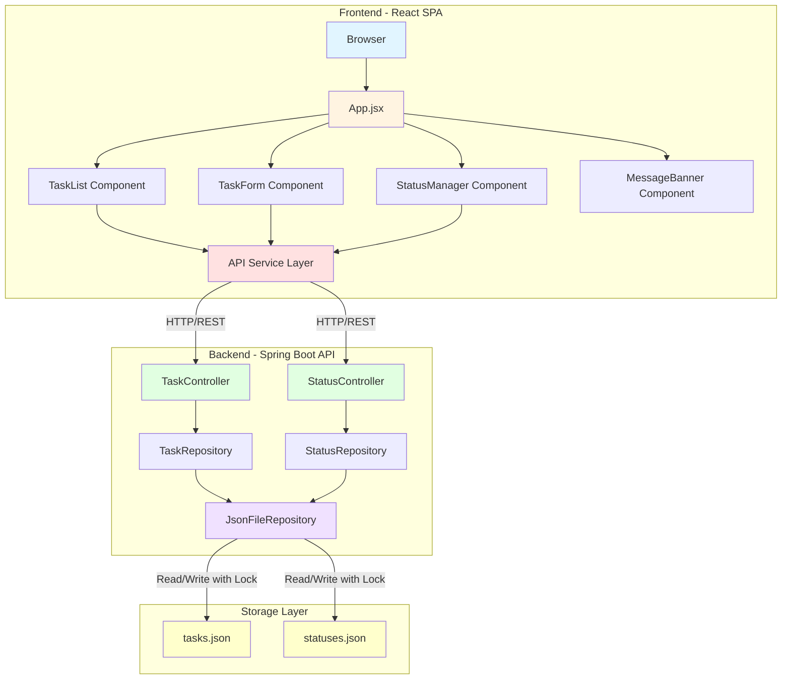
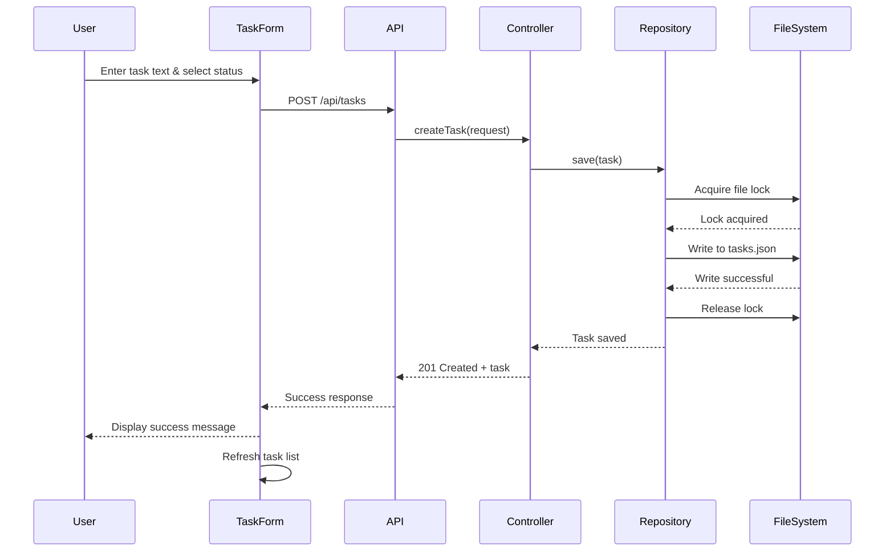
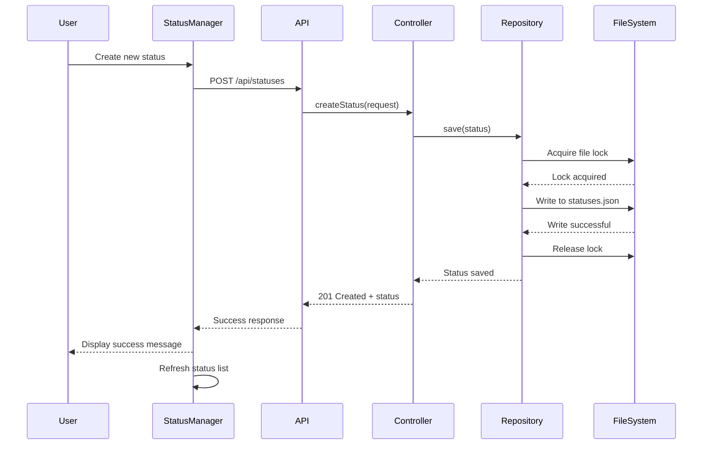
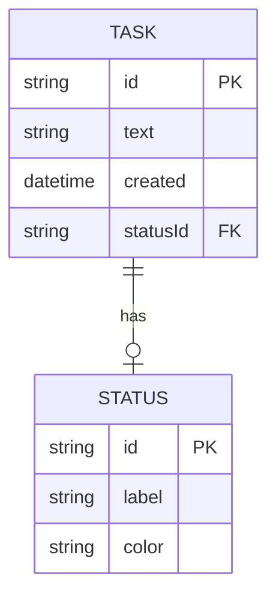
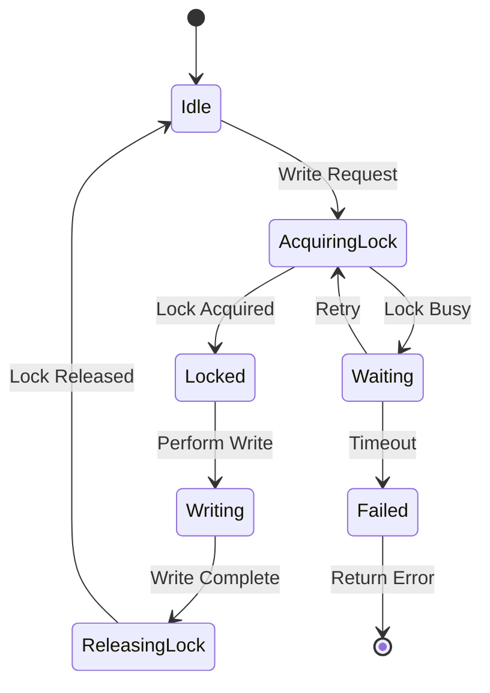
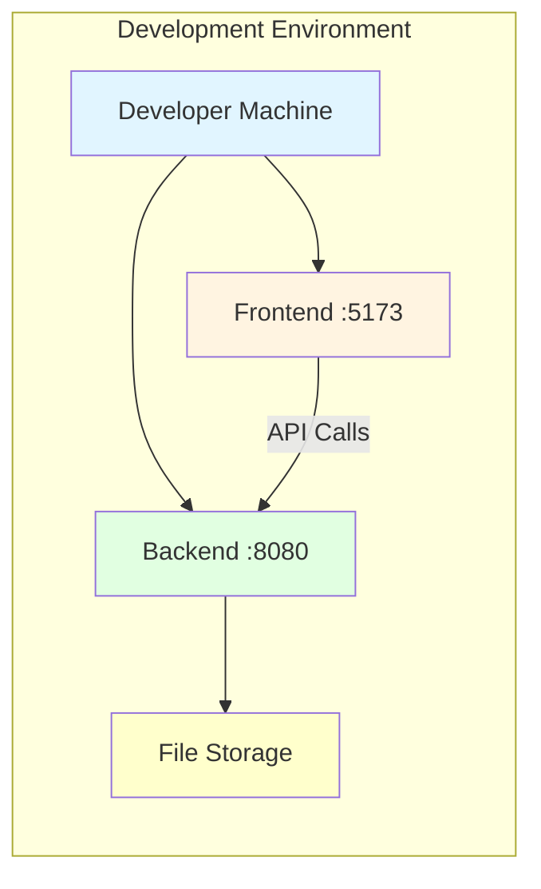
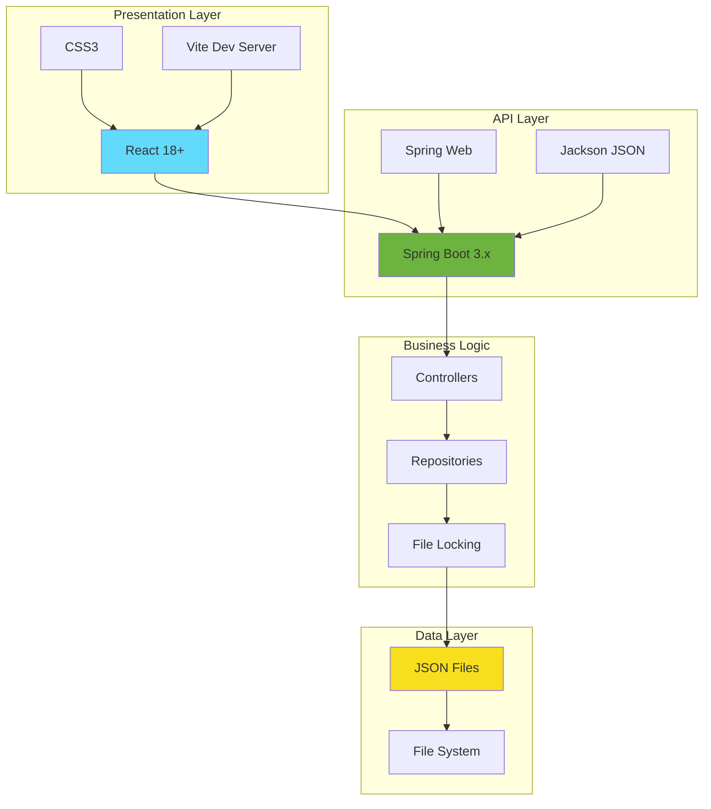
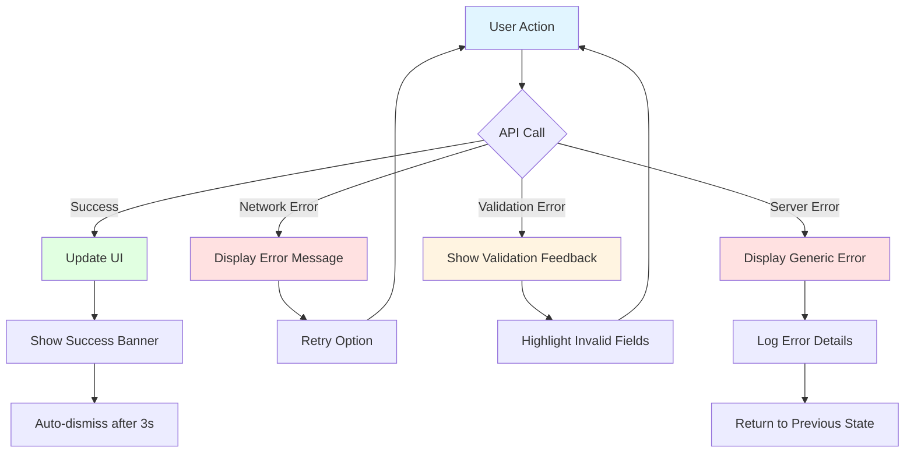
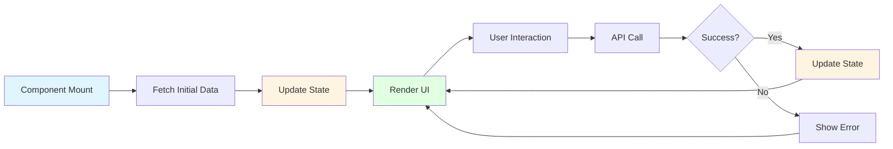

# Task Management System - Architecture Diagram

## System Overview

## Component Interaction Flow

### Task Creation Flow

### Status Management Flow

## Data Model Relationships

## File Locking Mechanism

## Deployment Architecture

## Technology Stack Layers

## Error Handling Flow

## State Management Pattern

---

## Key Design Decisions

### 1. Separation of Concerns
- **Frontend**: Pure presentation and user interaction
- **Backend**: Business logic and data persistence
- **Storage**: Simple JSON files with file locking

### 2. RESTful API Design
- Standard HTTP methods (GET, POST, PUT, DELETE)
- Proper status codes (200, 201, 204, 400, 404, 500)
- JSON request/response format

### 3. File Locking Strategy
- Exclusive locks for write operations
- Prevents concurrent write conflicts
- Timeout mechanism for deadlock prevention

### 4. Component Architecture
- Reusable React components
- Single responsibility principle
- Props-based communication

### 5. Error Handling
- Graceful degradation
- User-friendly error messages
- Automatic retry for transient failures

---

**Diagram Version**: 1.0  
**Last Updated**: 2026-01-20
